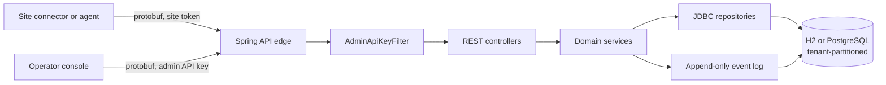

# Prosec SaaS Control Plane

A multi-tenant SaaS security control plane for container workloads. Sites connect directly to the SaaS application — there is no local manager tier — and publish inventory and observed network flows. Operators define global objects, grant access to them through object-user RBAC, and plan microsegmentation from discovered traffic.

Every API payload is a protobuf message carried over HTTP with the `application/x-protobuf` media type. The browser console is served by the same Spring application at `/`.

---

## Table Of Contents

| Section | Covers |
| --- | --- |
| [Product Shape](#product-shape) | The domain concepts the API is built from |
| [Architecture](#architecture) | Runtime components and request paths |
| [Quick Start](#quick-start) | Running the stack in one command |
| [Deployment](#deployment) | Prerequisites and every supported deployment path |
| [Initial Configuration](#initial-configuration) | Every setting, plus first-run bootstrap |
| [Security Model](#security-model) | Credential types, headers, error semantics |
| [API Reference](#api-reference) | All 19 endpoints, request and response messages |
| [Message Reference](#message-reference) | Every protobuf message and enum, field by field |
| [Event Types](#event-types) | The audit and change-feed vocabulary |
| [Data Model](#data-model) | Tables, keys, and what is stored where |
| [Enforcement Planning](#enforcement-planning) | How flow discovery becomes segmentation rules |
| [Operator Console](#operator-console) | The five UI views |
| [Operations](#operations) | Backup, upgrade, troubleshooting |
| [Production Readiness](#production-readiness) | What is intentionally still open |

---

## Product Shape

A **tenant** is an isolation boundary: a customer, business unit, or lab. Every other object either belongs to a tenant or is granted to one.

A **site** is a directly connected environment owned by a tenant — a datacenter, cloud network, Kubernetes estate, edge location, or test environment. A site authenticates with its own credential and publishes what it observes.

A **container workload** is the first MVP-managed asset. Connected sites publish container inventory, keyed by cluster, namespace, pod and container.

A **global object** is a centrally defined object such as a policy, inspection profile, container group, or network segment. Global objects are versioned, and every version is retained.

**OU-RBAC** (object user RBAC) governs visibility: a global object is usable by a tenant only when an object grant names that tenant along with the users, roles, and actions permitted.

A **segmentation rule** is a policy payload stored inside a `GLOBAL_POLICY` object that allows or denies traffic between two security groups on a protocol and port. Because it lives inside a global object, it inherits versioning, grants, and audit automatically.

---

## Architecture



Requests arrive at Spring MVC controllers that speak protobuf via `ProtobufHttpMessageConverter`. `AdminApiKeyFilter` gates every `/v1/**` path except the three site-authenticated endpoints, which verify a per-site credential inside their controllers instead. Domain services in `com.prosec.saas.service` hold the business rules; repositories in `com.prosec.saas.repository` persist serialized protobuf messages alongside the columns needed for keys, filtering and sorting. Every state change also appends an immutable record to the event log.

---

## Quick Start

From the repository root, with Docker installed:

```bash
docker compose up --build
```

Open `http://localhost:8080`. The console's left rail contains an admin API key field, pre-filled with the development default `dev-admin-key`.

To populate the instance with realistic data, build and run the smoke client in a second terminal:

```bash
docker build --target smoke-client -t prosec-saas-smoke-client .
docker run --rm prosec-saas-smoke-client http://host.docker.internal:8080 dev-admin-key
```

The smoke client prints the tenant id it created. Paste that id into the console's Inventory, Access, Events, and Enforcement views to browse what it produced.

---

## Deployment

### Prerequisites

| Requirement | Version | Needed for |
| --- | --- | --- |
| Docker Engine | 20.10+ | Container deployment |
| Docker Compose | v2.20+ | `depends_on` with `required: false` |
| JDK | 21 | Local (non-Docker) builds |
| Maven | 3.9+ | Local (non-Docker) builds |
| PostgreSQL | 12+ (16 recommended) | Optional external database |

No `protoc` installation is required. The Maven build generates Java classes from `src/main/proto/control_plane.proto` using `protobuf-maven-plugin`, which downloads a platform-matched `protoc` binary automatically. Both Docker and local builds run this step before compilation.

Outbound access to Maven Central is required at build time. Runtime has no external dependencies beyond the database.

### Option A — Docker Compose with embedded H2 (default)

The fastest path, and the one to use for evaluation and development. Data persists in a named Docker volume, so it survives container restarts and rebuilds.

```bash
cd /path/to/prosec
PROSEC_ADMIN_API_KEY='choose-a-strong-key' docker compose up --build -d
docker compose logs -f control-plane
```

The application listens on `http://localhost:8080`. The H2 database file lives at `/app/data/prosec.mv.db` inside the container, backed by the `control-plane-data` volume.

To stop while keeping data, `docker compose down`. To stop and discard data, `docker compose down -v`.

### Option B — Docker Compose with PostgreSQL

The `postgres` compose profile starts a PostgreSQL 16 container and points the application at it. The application waits for the database's health check before starting, so a cold first boot is safe.

```bash
SPRING_PROFILES_ACTIVE=postgres docker compose --profile postgres up --build -d
```

The profile's built-in defaults target the bundled service: `jdbc:postgresql://postgres:5432/prosec` with username and password `prosec`. Override all three for anything beyond local use, and note that the compose file's `postgres` service credentials must be changed to match:

```bash
SPRING_PROFILES_ACTIVE=postgres \
DB_URL='jdbc:postgresql://db.internal:5432/prosec' \
DB_USERNAME='prosec_app' \
DB_PASSWORD='...' \
PROSEC_ADMIN_API_KEY='...' \
docker compose up --build -d
```

When pointing at an external database, omit `--profile postgres` so compose does not start the bundled one.

### Option C — External database, container only

Build and run the application image by itself against a database you manage:

```bash
docker build -t prosec-saas-control-plane .
docker run -d --name prosec-control-plane \
  -p 8080:8080 \
  -e SPRING_PROFILES_ACTIVE=postgres \
  -e DB_URL='jdbc:postgresql://db.internal:5432/prosec' \
  -e DB_USERNAME='prosec_app' \
  -e DB_PASSWORD='...' \
  -e PROSEC_ADMIN_API_KEY='...' \
  prosec-saas-control-plane
```

If you run this way with the default H2 backend instead, mount a volume at `/app/data` — otherwise the database is lost when the container is removed:

```bash
docker run -d -p 8080:8080 -v prosec-data:/app/data \
  -e PROSEC_ADMIN_API_KEY='...' prosec-saas-control-plane
```

### Option D — Local Maven

For development with hot rebuilds, from the `saas-control-plane` directory:

```bash
export PROSEC_ADMIN_API_KEY='dev-admin-key'
mvn spring-boot:run
```

To produce a runnable jar:

```bash
mvn -DskipTests package
java -jar target/saas-control-plane-0.1.0-SNAPSHOT.jar
```

The H2 file is written to `./data/prosec.mv.db` relative to the working directory, and `.gitignore` already excludes both `target/` and `data/`.

### Production deployment notes

Terminate TLS in front of the application — a reverse proxy, ingress controller, or load balancer. The application speaks plain HTTP and does not manage certificates. If you plan to require client certificates from site connectors, terminate mTLS at that same layer and pass the verified identity through; the built-in site tokens then act as a second factor rather than the only one.

Run the application behind a proxy that strips or normalizes ambiguous request URIs. `AdminApiKeyFilter` already canonicalizes paths the way Spring's `PathPatternParser` does — decoding percent-escapes and stripping matrix parameters before matching — so obfuscated URIs cannot slip past the admin gate, but defense in depth at the edge is worthwhile.

Set `PROSEC_ADMIN_API_KEY` from your secret store, never from an image layer or a checked-in file. A blank value fails startup deliberately rather than silently accepting every request.

Scale horizontally by running several instances against one PostgreSQL database. All state lives in the database; the application keeps nothing in memory across requests. The event log's `seq` column is a database identity, so ordering stays consistent across instances. Do not run multiple instances against the file-backed H2 default — H2 in file mode is single-writer.

Health and metrics endpoints are not exposed in this build. Use a TCP or HTTP check against `/` for liveness until Spring Boot Actuator is added.

---

## Initial Configuration

### Configuration reference

Every setting is a Spring property with an environment-variable override. Environment variables win over the values baked into `application.yml`.

| Property | Environment variable | Default | Purpose |
| --- | --- | --- | --- |
| `prosec.security.admin-api-key` | `PROSEC_ADMIN_API_KEY` | `dev-admin-key` | Operator API key required on all admin endpoints. Blank fails startup. |
| `spring.datasource.url` | `DB_URL` | `jdbc:h2:file:./data/prosec;MODE=PostgreSQL;DATABASE_TO_LOWER=TRUE;DEFAULT_NULL_ORDERING=HIGH` | JDBC URL. The `postgres` profile defaults to `jdbc:postgresql://postgres:5432/prosec`. |
| `spring.datasource.username` | `DB_USERNAME` | `sa` (H2), `prosec` (postgres profile) | Database user. |
| `spring.datasource.password` | `DB_PASSWORD` | empty (H2), `prosec` (postgres profile) | Database password. |
| `spring.profiles.active` | `SPRING_PROFILES_ACTIVE` | none | Set to `postgres` to select the PostgreSQL datasource block. |
| `server.port` | `SERVER_PORT` | `8080` | HTTP listen port. |
| `spring.datasource.driver-class-name` | `SPRING_DATASOURCE_DRIVER_CLASS_NAME` | `org.h2.Driver`; `org.postgresql.Driver` under the `postgres` profile | JDBC driver. Selected by profile, not by URL. |
| `spring.sql.init.mode` | `SPRING_SQL_INIT_MODE` | `always` | Applies `schema.sql` on every startup. Leave as-is; the schema is idempotent. |
| `prosec.api.protobuf-media-type` | — | `application/x-protobuf` | Documented for reference; the media type is fixed in the controllers. |

The driver is chosen by the active profile rather than inferred from the URL. Setting `DB_URL` to a PostgreSQL URL *without* also setting `SPRING_PROFILES_ACTIVE=postgres` leaves the H2 driver configured and fails at startup — always set both together.

Any Spring property can be overridden by its `SCREAMING_SNAKE_CASE` environment variable through relaxed binding, whether or not `application.yml` names a placeholder for it. The variables in the table are the ones worth knowing; `SPRING_DATASOURCE_HIKARI_MAXIMUM_POOL_SIZE` and friends work the same way.

`spring.sql.init.mode: always` is required rather than cosmetic. Spring Boot does not classify a file-backed H2 database as "embedded", so the default `embedded` mode would silently skip `schema.sql` and the application would start against an empty database.

Docker Compose forwards `SPRING_PROFILES_ACTIVE`, `PROSEC_ADMIN_API_KEY`, `DB_URL`, `DB_USERNAME`, and `DB_PASSWORD` from the host environment using pass-through syntax, so a variable you do not set never reaches the container and the `application.yml` fallback applies. To add another override, list its name in the `control-plane` service's `environment` block — assigning an empty default there instead would shadow the fallback with an empty string.

### Setting the admin API key

The checked-in default `dev-admin-key` exists so a fresh clone runs without configuration. Replace it everywhere except a throwaway local instance:

```bash
# Docker Compose
PROSEC_ADMIN_API_KEY="$(openssl rand -base64 32)" docker compose up -d

# Kubernetes
kubectl create secret generic prosec-admin-key \
  --from-literal=PROSEC_ADMIN_API_KEY="$(openssl rand -base64 32)"
```

Rotating the key is a restart with a new value. Every operator client — including the console's rail field and the smoke client's second argument — must be updated at the same time, since there is no grace period for the previous key.

### Database initialization

No manual schema step is needed. `src/main/resources/schema.sql` runs at every startup and uses `CREATE TABLE IF NOT EXISTS` and `CREATE INDEX IF NOT EXISTS` throughout, so first boot creates the nine tables and later boots are no-ops. The same script is valid on both H2 in PostgreSQL compatibility mode and PostgreSQL 16.

For PostgreSQL, create the database and user before first start:

```sql
CREATE DATABASE prosec;
CREATE USER prosec_app WITH PASSWORD '...';
GRANT ALL PRIVILEGES ON DATABASE prosec TO prosec_app;
```

The application user needs `CREATE` on the schema for the startup script to run. If your policy forbids that, execute `schema.sql` once as a privileged user and grant the application user only `SELECT`, `INSERT`, `UPDATE`, `DELETE`.

### First-run bootstrap

A fresh instance has no tenants. Bring it into service in this order — each step depends on the one before it.

Create a tenant with `POST /v1/tenants`, which returns the generated tenant id. Every later call carries that id.

Connect a site with `POST /v1/sites/connect`. The response contains a `SiteCredential` whose `token` is returned exactly once and never again. Store it in the site connector's secret store immediately; if it is lost, the only recovery is `POST /v1/sites/credentials:rotate`, which issues a replacement and invalidates the old one.

Configure the site connector to send that token as `X-Prosec-Site-Token` and to call `POST /v1/sites/heartbeat` on an interval, `POST /v1/containers/inventory:upsert` when inventory changes, and `POST /v1/flows:report` at the end of each observation window.

Create the global objects the tenant needs with `POST /v1/global-objects`, then grant access with `POST /v1/ou-rbac/grants`, naming the users, roles, and actions permitted. Verify with `POST /v1/ou-rbac/decisions` before wiring a real consumer.

Once flows have been reported, load `POST /v1/enforcement/plan:get` and convert unprotected edges into segmentation rules with `POST /v1/enforcement/rules:apply`, or drive the whole loop from the console's Enforcement view.

### Verifying the installation

The smoke client exercises the entire surface end to end and is the fastest confidence check after any deployment or upgrade:

```bash
docker build --target smoke-client -t prosec-saas-smoke-client .
docker run --rm prosec-saas-smoke-client http://host.docker.internal:8080 "$PROSEC_ADMIN_API_KEY"
```

It creates a tenant, connects a site and captures the credential, heartbeats and publishes inventory using the site token, reports three flows, fetches the enforcement plan, applies a segmentation rule and reports how many edges are now protected, creates and updates a global object and counts the version history, grants access, evaluates decisions by user identity and by role, lists and revokes the grant, re-evaluates after the revoke, lists audit events, and finally prints the status returned for a deliberately wrong admin key.

It covers 15 of the 19 endpoints — it does not exercise `GET /v1/tenants/{tenantId}`, `POST /v1/sites/credentials:rotate`, `POST /v1/containers/inventory:list`, or `GET /v1/global-objects/{objectId}`. Any non-2xx response from an asserted call aborts the run naming the failing path; the post-revoke decision and the wrong-key status are printed for inspection rather than asserted, so read the output rather than relying on the exit code alone. Expect `decision-after-revoke=ACCESS_DENIED` and `wrong-admin-key-status=401`.

To confirm data survives a restart, run the smoke client, note the tenant id, restart the application, and fetch `GET /v1/tenants/{tenantId}`.

---

## Security Model

Two credential types protect the API, and each endpoint accepts exactly one of them.

The **admin API key** travels in the `X-Prosec-Api-Key` header and is required on every operator endpoint. It is a single shared secret configured with `PROSEC_ADMIN_API_KEY`; there is no per-operator identity yet, which is why operator actions appear in the event log with the actor `admin`.

The **site credential** travels in the `X-Prosec-Site-Token` header and authenticates the three endpoints a site connector calls. The token has the form `{siteId}.{secret}` and is issued exactly once, at connect or rotation. Only the SHA-256 hash of the secret is stored, so a database disclosure yields no usable credentials. Beyond verifying the token, the server checks that its site and tenant match the ones named in the request body — one site cannot publish inventory or flows on behalf of another.

All secret comparisons use constant-time equality. A rejected request returns HTTP 401 with an `AccessDecisionResponse` body whose `effect` is `ACCESS_DENIED` and whose `reason` explains the denial. Validation failures return HTTP 400 with the same message shape, which lets a client parse one type for every error case.

Transport security is expected to be terminated in front of the application; see the production deployment notes above.

---

## API Reference

### Conventions

All endpoints live under `/v1`. Request and response bodies are binary protobuf messages, not JSON. Set both headers on every call:

```
Content-Type: application/x-protobuf
Accept: application/x-protobuf
```

Endpoints that read a single resource by id use `GET` and take no body. Everything else uses `POST`. Action-style operations use a colon suffix on the final path segment — `inventory:upsert`, `grants:revoke`, `plan:get` — following the AIP custom-method convention. Do not percent-encode the colon; send it literally.

The protobuf contract is `src/main/proto/control_plane.proto`. Generate client stubs from it with `protoc`, for example:

```bash
protoc --python_out=. --proto_path=src/main/proto src/main/proto/control_plane.proto
protoc --go_out=. --proto_path=src/main/proto src/main/proto/control_plane.proto
```

A minimal Python client, once stubs are generated:

```python
import requests, control_plane_pb2 as pb

BASE = "http://localhost:8080"
ADMIN = {"Content-Type": "application/x-protobuf",
         "Accept": "application/x-protobuf",
         "X-Prosec-Api-Key": "dev-admin-key"}

req = pb.CreateTenantRequest(display_name="Acme Security Lab")
r = requests.post(f"{BASE}/v1/tenants", data=req.SerializeToString(), headers=ADMIN)
r.raise_for_status()
resp = pb.TenantResponse(); resp.ParseFromString(r.content)
print(resp.tenant.id)
```

### Error responses

| Status | Condition | Body |
| --- | --- | --- |
| `400 Bad Request` | Validation failure, unknown id, inactive tenant, concurrent object update | `AccessDecisionResponse` with `ACCESS_DENIED` and a reason |
| `401 Unauthorized` | Missing, malformed, or invalid admin key or site token; site/tenant mismatch | `AccessDecisionResponse` with `ACCESS_DENIED` and a reason |

### Endpoint summary

| # | Method and path | Auth | Request | Response |
| --- | --- | --- | --- | --- |
| 1 | `POST /v1/tenants` | admin key | `CreateTenantRequest` | `TenantResponse` |
| 2 | `GET /v1/tenants/{tenantId}` | admin key | — | `TenantResponse` |
| 3 | `POST /v1/sites/connect` | admin key | `ConnectSiteRequest` | `SiteResponse` |
| 4 | `POST /v1/sites/credentials:rotate` | admin key | `RotateSiteCredentialRequest` | `SiteResponse` |
| 5 | `POST /v1/sites/heartbeat` | site token | `SiteHeartbeatRequest` | `SiteResponse` |
| 6 | `POST /v1/containers/inventory:upsert` | site token | `UpsertContainerInventoryRequest` | `ContainerInventoryResponse` |
| 7 | `POST /v1/containers/inventory:list` | admin key | `ListContainerInventoryRequest` | `ContainerInventoryResponse` |
| 8 | `POST /v1/global-objects` | admin key | `CreateGlobalObjectRequest` | `GlobalObjectResponse` |
| 9 | `GET /v1/global-objects/{objectId}` | admin key | — | `GlobalObjectResponse` |
| 10 | `POST /v1/global-objects/{objectId}:update` | admin key | `UpdateGlobalObjectRequest` | `GlobalObjectResponse` |
| 11 | `GET /v1/global-objects/{objectId}/versions` | admin key | — | `GlobalObjectVersionListResponse` |
| 12 | `POST /v1/ou-rbac/grants` | admin key | `GrantObjectAccessRequest` | `ObjectGrantResponse` |
| 13 | `POST /v1/ou-rbac/grants:list` | admin key | `ListObjectGrantsRequest` | `ObjectGrantListResponse` |
| 14 | `POST /v1/ou-rbac/grants:revoke` | admin key | `RevokeObjectAccessRequest` | `ObjectGrantResponse` |
| 15 | `POST /v1/ou-rbac/decisions` | admin key | `EvaluateAccessRequest` | `AccessDecisionResponse` |
| 16 | `POST /v1/events:list` | admin key | `ListEventsRequest` | `EventListResponse` |
| 17 | `POST /v1/flows:report` | site token | `ReportFlowsRequest` | `FlowReportResponse` |
| 18 | `POST /v1/enforcement/plan:get` | admin key | `EnforcementPlanRequest` | `EnforcementPlanResponse` |
| 19 | `POST /v1/enforcement/rules:apply` | admin key | `ApplySegmentationRuleRequest` | `GlobalObjectResponse` |

### Tenants

**`POST /v1/tenants`** creates a tenant. The only input is `display_name`; the id, `TENANT_ACTIVE` lifecycle, and creation timestamp are assigned by the server. Emits `tenant.created`.

**`GET /v1/tenants/{tenantId}`** returns one tenant. Responds `400` if the id is unknown.

Every other endpoint that names a tenant first checks that it exists and is `TENANT_ACTIVE`, producing `400` with "Tenant is not active" otherwise. The one exception is `POST /v1/events:list`, which treats `tenant_id` purely as a query filter — an unknown or suspended tenant id returns an empty page rather than an error, so audit reads keep working after a tenant is suspended.

### Sites

**`POST /v1/sites/connect`** registers a new site under a tenant and returns both the `Site` and a one-time `SiteCredential`. The credential's `token` is the only copy — the server keeps a hash. Emits `site.connected`.

**`POST /v1/sites/credentials:rotate`** issues a replacement credential for an existing site and immediately invalidates the previous one. Use it for scheduled rotation or to recover a lost token. The response's `site` field carries the site's current state; the `credential` field carries the new token. Emits `site.credential_rotated`.

**`POST /v1/sites/heartbeat`** refreshes `last_seen_epoch_ms` and sets `connection_state` to `SITE_CONNECTED`. Authenticated with the site token, which must match the `tenant_id` and `site_id` in the body. The response contains only `site`; no credential is returned.

### Container inventory

**`POST /v1/containers/inventory:upsert`** publishes workloads from a site. The server overwrites `tenant_id`, `site_id`, and `observed_at_epoch_ms` on every workload from the authenticated request context, so those fields need not be set by the caller. A workload with a blank `id` receives a stable derived id computed from tenant, site, cluster, namespace, pod, container, and image digest — so repeated reports of the same container update one row rather than accumulating duplicates. Emits one `inventory.upserted` event per request. Authenticated with the site token.

**`POST /v1/containers/inventory:list`** queries inventory for a tenant. `site_id` and `namespace` are optional filters; leave either blank to match all. Results are ordered by namespace, then pod, then container. Authenticated with the admin key.

### Global objects

**`POST /v1/global-objects`** creates an object at version 1 and archives that version. `protobuf_payload` is an opaque byte string as far as the object store is concerned — the enforcement planner uses it to carry a `SegmentationRule`, but any encoding is accepted. Emits `object.created`.

**`GET /v1/global-objects/{objectId}`** returns the current version of one object.

**`POST /v1/global-objects/{objectId}:update`** increments the version, refreshes `updated_at_epoch_ms`, and archives the new version. Both `display_name` and `protobuf_payload` are optional; a blank name or empty payload leaves the existing value in place, so a payload-only update preserves the name. Version history is append-only: if another update raced this one and already claimed the next version number, the whole transaction rolls back and the call returns `400` with "Concurrent update detected" — reload and retry. Emits `object.updated`.

**`GET /v1/global-objects/{objectId}/versions`** returns the full history, newest first. Objects created before versioning existed report version 0 and gain history from their first update onward.

### OU-RBAC

**`POST /v1/ou-rbac/grants`** creates or replaces the grant for one `(tenant, object)` pair. The grant names `user_ids`, `roles`, and `actions`. There is at most one grant per pair, so re-granting replaces rather than accumulates. Emits `grant.created`.

**`POST /v1/ou-rbac/grants:list`** returns every grant held by a tenant, ordered by object id.

**`POST /v1/ou-rbac/grants:revoke`** deletes the grant and returns the grant as it was immediately before deletion, so the caller can log or undo it. Responds `400` if no grant exists. Emits `grant.revoked`.

**`POST /v1/ou-rbac/decisions`** evaluates access. The decision is allowed when the object is granted to the tenant, the caller matches the grant by either `user_id` or any asserted role, and the requested `action` appears in the grant's action list — or the list contains the wildcard `*`. The response's `reason` states the basis, distinguishing "user identity" from "role membership", which makes decisions debuggable without reading the grant. Every evaluation, allowed or denied, emits `access.evaluated`.

### Events

**`POST /v1/events:list`** reads the append-only event log in one of two modes.

With `after_seq` set to `0`, the response is the most recent events in descending order — the audit view — and `latest_seq` is the newest sequence number in the whole log.

With `after_seq` greater than `0`, the response contains events with a higher sequence number in ascending order — the change-feed view — and `latest_seq` is the sequence number of the last event actually delivered in this page. Advance your cursor to that value, never to a globally observed maximum, or you will skip events when a tenant has more changes than one page holds.

`tenant_id` and `event_type` are optional filters; blank matches all. `limit` defaults to 100 and is capped at 500.

### Enforcement

**`POST /v1/flows:report`** accepts aggregated flow observations from a site, authenticated with the site token. Each flow names a source group, destination group, protocol (`TCP` or `UDP`, case-insensitive), port, an optional service hint, and a session count for the window. A blank group means traffic outside the overlay and is normalized to the reserved group id `external`; a flow that is external on both ends is rejected. Ports must be 1–65535, group names 255 characters or fewer, and service hints 120 or fewer. The whole batch is validated before anything is written, so an invalid flow rejects the entire report rather than persisting part of it. Storage is last-write-wins per `(tenant, src, dst, protocol, port)` edge, which means sites should report rolling-window totals rather than deltas. Emits `flows.reported`.

**`POST /v1/enforcement/plan:get`** returns the complete microsegmentation picture for a tenant: the derived security groups, every observed flow edge annotated with its protection status and the rule object governing it, the interfaces where enforcement would land, and the default enforcement string. See [Enforcement Planning](#enforcement-planning) for how each part is derived.

**`POST /v1/enforcement/rules:apply`** converts an edge into a segmentation rule. `action` is `allow` or `deny`, `protocol` is `TCP` or `UDP`, and `port` may be `0` to mean any port. The rule is stored as a `SegmentationRule` payload inside a new `GLOBAL_POLICY` object named `seg-{action}-{src}-to-{dst}-{port}`, where `{port}` is the literal string `any` when the port is `0`. The stored rule normalizes its inputs: `action` is lower-cased, `protocol` upper-cased, and a blank group becomes `external`. The created object is returned. Applying the same rule twice creates two objects; deduplication is not performed. Emits both `object.created` and `rule.applied`.

---

## Message Reference

### Enums

| Enum | Values |
| --- | --- |
| `TenantLifecycle` | `TENANT_LIFECYCLE_UNSPECIFIED` = 0, `TENANT_ACTIVE` = 1, `TENANT_SUSPENDED` = 2 |
| `SiteConnectionState` | `SITE_CONNECTION_STATE_UNSPECIFIED` = 0, `SITE_CONNECTED` = 1, `SITE_DEGRADED` = 2, `SITE_DISCONNECTED` = 3 |
| `ContainerRuntime` | `CONTAINER_RUNTIME_UNSPECIFIED` = 0, `CONTAINERD` = 1, `CRI_O` = 2, `DOCKER` = 3 |
| `ObjectType` | `OBJECT_TYPE_UNSPECIFIED` = 0, `GLOBAL_POLICY` = 1, `CONTAINER_GROUP` = 2, `INSPECTION_PROFILE` = 3, `NETWORK_SEGMENT` = 4 |
| `AccessEffect` | `ACCESS_EFFECT_UNSPECIFIED` = 0, `ACCESS_DENIED` = 1, `ACCESS_ALLOWED` = 2 |
| `FlowProtection` | `FLOW_PROTECTION_UNSPECIFIED` = 0, `FLOW_UNPROTECTED` = 1, `FLOW_PROTECTED` = 2, `FLOW_DENIED` = 3 |

### Tenant messages

**`Tenant`** — `id` (1, string), `display_name` (2, string), `lifecycle` (3, `TenantLifecycle`), `created_at_epoch_ms` (4, int64).

**`CreateTenantRequest`** — `display_name` (1, string).

**`TenantResponse`** — `tenant` (1, `Tenant`).

### Site messages

**`Site`** — `id` (1, string), `tenant_id` (2, string), `display_name` (3, string), `region` (4, string), `connection_state` (5, `SiteConnectionState`), `last_seen_epoch_ms` (6, int64).

**`ConnectSiteRequest`** — `tenant_id` (1, string), `display_name` (2, string), `region` (3, string).

**`SiteHeartbeatRequest`** — `tenant_id` (1, string), `site_id` (2, string).

**`SiteCredential`** — `site_id` (1, string), `token` (2, string), `issued_at_epoch_ms` (3, int64). The `token` is returned only at issue time.

**`RotateSiteCredentialRequest`** — `tenant_id` (1, string), `site_id` (2, string).

**`SiteResponse`** — `site` (1, `Site`), `credential` (2, `SiteCredential`). The `credential` field is populated only by `connect` and `credentials:rotate`.

### Container inventory messages

**`ContainerWorkload`** — `id` (1, string), `tenant_id` (2, string), `site_id` (3, string), `cluster_name` (4, string), `namespace` (5, string), `pod_name` (6, string), `container_name` (7, string), `image` (8, string), `image_digest` (9, string), `runtime` (10, `ContainerRuntime`), `labels` (11, map<string,string>), `ip_addresses` (12, repeated string), `observed_at_epoch_ms` (13, int64).

**`UpsertContainerInventoryRequest`** — `tenant_id` (1, string), `site_id` (2, string), `containers` (3, repeated `ContainerWorkload`).

**`ListContainerInventoryRequest`** — `tenant_id` (1, string), `site_id` (2, string, optional filter), `namespace` (3, string, optional filter).

**`ContainerInventoryResponse`** — `containers` (1, repeated `ContainerWorkload`).

### Global object messages

**`GlobalObject`** — `id` (1, string), `object_type` (2, `ObjectType`), `display_name` (3, string), `protobuf_payload` (4, bytes), `created_at_epoch_ms` (5, int64), `version` (6, int64), `updated_at_epoch_ms` (7, int64).

**`CreateGlobalObjectRequest`** — `object_type` (1, `ObjectType`), `display_name` (2, string), `protobuf_payload` (3, bytes).

**`UpdateGlobalObjectRequest`** — `object_id` (1, string, ignored by the server — the `{objectId}` path variable is authoritative), `display_name` (2, string, optional), `protobuf_payload` (3, bytes, optional).

**`GlobalObjectResponse`** — `object` (1, `GlobalObject`).

**`GlobalObjectVersionListResponse`** — `versions` (1, repeated `GlobalObject`), newest first.

### OU-RBAC messages

**`ObjectGrant`** — `object_id` (1, string), `tenant_id` (2, string), `user_ids` (3, repeated string), `roles` (4, repeated string), `actions` (5, repeated string). `actions` may contain `*` as a wildcard.

**`GrantObjectAccessRequest`** — `grant` (1, `ObjectGrant`).

**`ObjectGrantResponse`** — `grant` (1, `ObjectGrant`).

**`ListObjectGrantsRequest`** — `tenant_id` (1, string).

**`ObjectGrantListResponse`** — `grants` (1, repeated `ObjectGrant`).

**`RevokeObjectAccessRequest`** — `tenant_id` (1, string), `object_id` (2, string).

**`EvaluateAccessRequest`** — `object_id` (1, string), `tenant_id` (2, string), `user_id` (3, string), `action` (4, string), `roles` (5, repeated string, asserted by the caller's identity provider).

**`AccessDecisionResponse`** — `effect` (1, `AccessEffect`), `reason` (2, string). Also used as the body of every 400 and 401 error.

### Event messages

**`EventRecord`** — `seq` (1, int64, assigned by the log), `tenant_id` (2, string), `event_type` (3, string), `actor` (4, string), `object_id` (5, string), `detail` (6, string), `occurred_at_epoch_ms` (7, int64).

**`ListEventsRequest`** — `tenant_id` (1, string, optional filter), `event_type` (2, string, optional filter), `after_seq` (3, int64), `limit` (4, int32, default 100, max 500).

**`EventListResponse`** — `events` (1, repeated `EventRecord`), `latest_seq` (2, int64).

### Enforcement messages

**`ReportedFlow`** — `src_group` (1, string), `dst_group` (2, string), `protocol` (3, string, `TCP` or `UDP`), `port` (4, uint32), `service_hint` (5, string), `sessions` (6, int64).

**`ReportFlowsRequest`** — `tenant_id` (1, string), `site_id` (2, string), `flows` (3, repeated `ReportedFlow`).

**`FlowReportResponse`** — `accepted` (1, int32).

**`SegmentationRule`** — `tenant_id` (1, string), `src_group` (2, string), `dst_group` (3, string), `protocol` (4, string), `port` (5, uint32, 0 means any), `action` (6, string, `allow` or `deny`). Carried inside a `GLOBAL_POLICY` object's `protobuf_payload`.

**`SecurityGroupSummary`** — `id` (1, string), `display_name` (2, string), `members` (3, repeated string).

**`FlowEdge`** — `src_group` (1, string), `dst_group` (2, string), `protocol` (3, string), `port` (4, uint32), `service_hint` (5, string), `sessions` (6, int64), `protection` (7, `FlowProtection`), `rule_object_id` (8, string, set when a rule matched).

**`EnforcementInterface`** — `interface_name` (1, string), `workload` (2, string), `group` (3, string), `site_id` (4, string), `default_enforcement` (5, string), `mode` (6, string, `monitor` or `enforced`).

**`EnforcementPlanRequest`** — `tenant_id` (1, string).

**`EnforcementPlanResponse`** — `groups` (1, repeated `SecurityGroupSummary`), `edges` (2, repeated `FlowEdge`), `interfaces` (3, repeated `EnforcementInterface`), `default_enforcement` (4, string).

**`ApplySegmentationRuleRequest`** — `tenant_id` (1, string), `src_group` (2, string), `dst_group` (3, string), `protocol` (4, string), `port` (5, uint32), `action` (6, string).

---

## Event Types

Every state change appends one record. Filter on these values with `ListEventsRequest.event_type`.

| Event type | Actor | Emitted when |
| --- | --- | --- |
| `tenant.created` | `admin` | A tenant is created |
| `site.connected` | `admin` | A site connects and receives its first credential |
| `site.credential_rotated` | `admin` | A site credential is reissued |
| `inventory.upserted` | site id | A site publishes container inventory |
| `flows.reported` | site id | A site reports aggregated flows |
| `object.created` | `admin` | A global object is created, including rule objects |
| `object.updated` | `admin` | A global object version is incremented |
| `grant.created` | `admin` | An object grant is created or replaced |
| `grant.revoked` | `admin` | An object grant is deleted |
| `access.evaluated` | requesting user id | An access decision is made, allowed or denied |
| `rule.applied` | `admin` | A segmentation rule is applied from the planner |

Records carrying a tenant id are visible in tenant-filtered queries. `object.created` and `object.updated` are recorded with a blank tenant id because global objects are not owned by a tenant; query them without a tenant filter.

Because `access.evaluated` fires on every decision, the log grows with authorization traffic. No retention policy ships in this build — see [Production Readiness](#production-readiness).

---

## Data Model

Protobuf messages remain the source of truth. Each row stores the serialized message as a `payload` blob together with the columns needed for primary keys, tenant partitioning, filtering, and sorting. Reads deserialize the payload; the columns exist so the database can do the work it is good at.

| Table | Primary key | Indexed columns | Holds |
| --- | --- | --- | --- |
| `tenants` | `id` | — | `Tenant`, plus a denormalized `lifecycle` |
| `sites` | `id` | `tenant_id` | `Site` |
| `site_credentials` | `site_id` | — | Site id, tenant id, SHA-256 token hash, issue time |
| `container_workloads` | `tenant_id`, `workload_id` | `(tenant_id, site_id)`, `(tenant_id, namespace)` | `ContainerWorkload` |
| `global_objects` | `id` | — | Current `GlobalObject` |
| `global_object_versions` | `object_id`, `version` | — | Every archived `GlobalObject` version |
| `object_grants` | `tenant_id`, `object_id` | — | `ObjectGrant` |
| `event_log` | `seq` (identity) | `(tenant_id, seq)`, `(event_type, seq)` | `EventRecord` |
| `flow_edges` | `tenant_id`, `src_group`, `dst_group`, `protocol`, `port` | — | Observed flow with session count and reporter |

Upserts are written as update-then-insert with a duplicate-key retry rather than `ON CONFLICT` or `MERGE`, so one code path works identically on H2 and PostgreSQL. `global_object_versions` is the exception: it is insert-only, and a duplicate key is treated as a concurrency conflict rather than something to retry.

---

## Enforcement Planning

The Enforcement view works the way VMware vRNI's "Plan Security" does: it discovers where enforcement is required, shows what is currently enforced there, and turns observed traffic into proposed rules.

**Security groups are derived, not configured.** Each namespace found in container inventory becomes a group whose members are its pod and container names. The reserved group `external`, displayed as "Internet / External", represents everything outside the overlay. Any group referenced by a reported flow but absent from inventory is included with no members, so traffic to a workload the control plane has not yet seen is still visible.

**Protection status comes from matching each observed edge against segmentation rules.** A rule matches when source group, destination group and protocol are equal and the rule's port either equals the edge's port or is `0`. When several rules match, precedence is deterministic: deny beats allow, and within an action an exact port beats a wildcard. A matching allow marks the edge `FLOW_PROTECTED`, a matching deny marks it `FLOW_DENIED`, and no match marks it `FLOW_UNPROTECTED` — real traffic currently falling through to the default enforcement.

**Enforcement interfaces are where rules would be realized.** The plan lists one virtual NIC per container workload in monitor mode with a default of "Allow + log", plus each site's north-south uplink in enforced mode with a default of "Allow established, log new", and each site's east-west overlay bridge in monitor mode.

**Rules become policy objects.** Applying a rule writes a `SegmentationRule` into a new `GLOBAL_POLICY` object, so the rule is versioned, grantable, and audited like any other object, and can be inspected through the global object API without a separate rule store.

Sites should report rolling-window totals because storage is last-write-wins per edge. An edge that stops appearing in reports keeps its last observed session count until it is overwritten; there is no automatic expiry of stale edges in this build.

---

## Operator Console

The console is served at `/` and speaks the same protobuf API as any other client, using the admin API key entered in the left rail. It has no server-side session; the key and the current site token live only in the page's memory.

**Control** runs the MVP flow end to end — create a tenant, connect a site, heartbeat with the issued credential, publish inventory, create a policy object, grant access, evaluate a decision — with status tiles and an execution log. It is the fastest way to produce data on a fresh instance.

**Inventory** browses container workloads for a tenant with optional site and namespace filters.

**Access** lists a tenant's grants with one-click revoke, and includes a decision tester that evaluates a user, roles, and action against a live object.

**Events** shows the audit trail newest-first with tenant, type, and limit filters.

**Enforcement** loads a tenant's plan and renders the security-group wheel with observed flows — solid green for protected, dashed orange for unprotected, dotted red for deny-enforced, thickness tracking session volume. Selecting a group or a flow shows per-edge recommendations with one-click allow or deny, and a single action applies every recommended allow rule at once. Below the wheel, the discovered interfaces table shows where enforcement lands, filtered to the selected group.

---

## Operations

### Backup and restore

For PostgreSQL, back up with your normal tooling — `pg_dump prosec` captures everything, since no state lives outside the database.

For the H2 default, the entire database is the file at `/app/data/prosec.mv.db`. Stop the application before copying it, or use H2's `BACKUP TO` command against a live instance. With Docker Compose the file lives in the `control-plane-data` volume:

```bash
docker compose stop control-plane
docker run --rm -v prosec_control-plane-data:/data -v "$PWD":/backup alpine \
  tar czf /backup/prosec-h2-backup.tar.gz -C /data .
docker compose start control-plane
```

Site credentials are stored only as hashes, so a restored backup does not let you recover tokens a connector has lost — rotate instead.

### Upgrades

Rebuild the image and restart. `schema.sql` is idempotent and additive, so a newer build creates any new tables on first start and leaves existing data untouched. Because existing rows hold serialized protobuf, adding fields to the contract is backward compatible: old rows deserialize with the new fields at their defaults. Never renumber or reuse a field number in `control_plane.proto` — that would silently reinterpret stored payloads.

Roll back by redeploying the previous image; rows written by the newer build keep any fields the older code does not know about, since protobuf preserves unknown fields on round-trip only if the code re-serializes what it parsed. Verify before relying on this in a specific case.

### Troubleshooting

If startup fails with a message about the admin API key, `PROSEC_ADMIN_API_KEY` resolved to blank. This is deliberate; set a real value.

If every admin call returns 401, confirm the client is sending `X-Prosec-Api-Key` and that the value matches exactly, including any trailing newline your shell may have added — `printf` rather than `echo` when injecting from a script.

If a site call returns 401 with "Site credential does not match", the token is valid but names a different site or tenant than the request body. If it returns "Unknown site credential", the credential was rotated and the connector is still using the old token.

If the application starts but every request fails with an SQL error mentioning a missing table, `schema.sql` did not run. Confirm `spring.sql.init.mode` is `always` and that the database user has `CREATE` permission.

If the console renders unstyled, it is being opened from the filesystem rather than served — the page references `/styles.css` and `/app.js` as absolute paths. Open `http://localhost:8080` instead.

If the Enforcement view shows groups but no flows, no site has reported any yet. Run the smoke client or have a connector call `/v1/flows:report`.

To watch what the control plane is doing, poll the event log in change-feed mode with `after_seq` set to your last cursor; it reports every state change in order without polling each resource.

---

## Production Readiness

The following are known and intentional gaps in this build, listed so they can be planned rather than discovered.

Operator identity is a single shared API key, so the event log attributes every operator action to `admin`. Replacing it with OIDC or SSO would give per-operator attribution and revocation without a restart.

Transport security and site certificate identity are expected from the layer in front of the application. Site tokens authenticate the connector but do not pin it to a certificate.

There are no rate limits or per-tenant quotas, so an authenticated site can report unbounded inventory and flows, and `access.evaluated` events accumulate without a retention policy.

Change notification is poll-based. A server-push feed — SSE or gRPC streaming — would remove the polling interval from the change-detection latency.

Stale flow edges are never expired, and applying the same segmentation rule twice creates duplicate policy objects; neither affects correctness of the plan, but both add noise over time.

Health, readiness, and metrics endpoints are not exposed. Adding Spring Boot Actuator would make the service observable to standard orchestration and monitoring.
