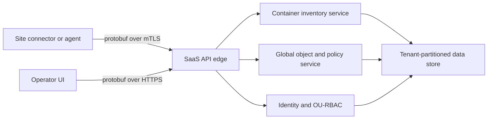

# Prosec SaaS Control Plane

This folder is the Java/Spring direction for the original network security prototype. It moves the management plane into SaaS, while sites connect directly to the SaaS application. There is no local manager tier and no product vocabulary borrowed from other vendors.

## Product Shape

The platform has these enterprise control-plane concepts:

- **Tenant**: a customer, business unit, lab, or other isolation boundary.
- **Site**: a directly connected environment owned by a tenant. A site can represent a datacenter, cloud network, Kubernetes estate, edge location, or test environment.
- **Global object**: a centrally defined object such as a policy, inspection profile, container group, or network segment.
- **OU-RBAC**: object user RBAC. A global object is visible or usable only when an object grant gives a tenant, users, roles, and actions access to that object.
- **Container workload**: the first MVP-managed asset. A connected site publishes container inventory to the SaaS plane using protobuf.

## UI And MVP Scope

The app includes a browser UI served by Spring at `/`. The UI drives the MVP flow using protobuf binary requests to the backend.

The MVP intentionally starts with containers:

1. Create a tenant.
2. Connect a site directly to SaaS.
3. Publish container inventory from the site.
4. Create global objects.
5. Grant tenant/user/action access to global objects.
6. Evaluate access decisions using OU-RBAC.

All backend payloads are protobuf messages. The HTTP surface uses `application/x-protobuf` instead of JSON.

## API Surface

| Area | Endpoint | Auth | Protobuf request | Protobuf response |
| --- | --- | --- | --- | --- |
| Tenants | `POST /v1/tenants` | admin key | `CreateTenantRequest` | `TenantResponse` |
| Tenants | `GET /v1/tenants/{tenantId}` | admin key | none | `TenantResponse` |
| Sites | `POST /v1/sites/connect` | admin key | `ConnectSiteRequest` | `SiteResponse` (includes one-time `SiteCredential`) |
| Sites | `POST /v1/sites/credentials:rotate` | admin key | `RotateSiteCredentialRequest` | `SiteResponse` (new `SiteCredential`) |
| Sites | `POST /v1/sites/heartbeat` | site token | `SiteHeartbeatRequest` | `SiteResponse` |
| Containers | `POST /v1/containers/inventory:upsert` | site token | `UpsertContainerInventoryRequest` | `ContainerInventoryResponse` |
| Containers | `POST /v1/containers/inventory:list` | admin key | `ListContainerInventoryRequest` | `ContainerInventoryResponse` |
| Global Objects | `POST /v1/global-objects` | admin key | `CreateGlobalObjectRequest` | `GlobalObjectResponse` |
| Global Objects | `GET /v1/global-objects/{objectId}` | admin key | none | `GlobalObjectResponse` |
| Global Objects | `POST /v1/global-objects/{objectId}:update` | admin key | `UpdateGlobalObjectRequest` | `GlobalObjectResponse` |
| Global Objects | `GET /v1/global-objects/{objectId}/versions` | admin key | none | `GlobalObjectVersionListResponse` |
| OU-RBAC | `POST /v1/ou-rbac/grants` | admin key | `GrantObjectAccessRequest` | `ObjectGrantResponse` |
| OU-RBAC | `POST /v1/ou-rbac/grants:list` | admin key | `ListObjectGrantsRequest` | `ObjectGrantListResponse` |
| OU-RBAC | `POST /v1/ou-rbac/grants:revoke` | admin key | `RevokeObjectAccessRequest` | `ObjectGrantResponse` |
| OU-RBAC | `POST /v1/ou-rbac/decisions` | admin key | `EvaluateAccessRequest` | `AccessDecisionResponse` |
| Events | `POST /v1/events:list` | admin key | `ListEventsRequest` | `EventListResponse` |

The protobuf contract is in `src/main/proto/control_plane.proto`.

## Security Model

Two credential types protect the API:

- **Admin API key** (`X-Prosec-Api-Key` header): required on every operator endpoint. Configured with `prosec.security.admin-api-key` / the `PROSEC_ADMIN_API_KEY` env var; the checked-in default `dev-admin-key` is for local development only and must be overridden in every real deployment. The browser UI has an API-key field in the left rail.
- **Site credential** (`X-Prosec-Site-Token` header): issued exactly once when a site connects (and again on rotation via `credentials:rotate`). The token has the form `{siteId}.{secret}`; the server stores only the SHA-256 hash of the secret, so the database never contains usable credentials. Heartbeat and inventory upsert authenticate with this token, and the server verifies the token's site/tenant identity matches the request body — one site cannot publish inventory as another.

All comparisons are constant-time. Unauthorized requests receive HTTP 401 with a protobuf `AccessDecisionResponse` explaining the denial. Transport security (TLS/mTLS) is expected to be terminated in front of the app in production.

## RBAC, Versioning, And The Event Log

**OU-RBAC** decisions match either the user id or any caller-asserted role against the object grant (`EvaluateAccessRequest.roles`), then check the action list (`*` acts as a wildcard). Grants can be listed per tenant and revoked; a revoked object immediately denies.

**Global object versioning**: every object starts at version 1; `:update` bumps the version, refreshes `updated_at_epoch_ms`, and archives the full object into `global_object_versions`, so `/versions` returns the complete history newest-first.

**Event log**: a single append-only stream (`event_log` table, `EventRecord` message) doubles as the audit trail and the change feed. Recorded events include `tenant.created`, `site.connected`, `site.credential_rotated`, `inventory.upserted`, `object.created`, `object.updated`, `grant.created`, `grant.revoked`, and `access.evaluated`. Query semantics: with `after_seq > 0` the response is ascending (change-feed polling for site agents and UIs); with `after_seq = 0` it is descending latest-first (audit view). `latest_seq` in the response is the polling cursor.

## Target Enterprise Architecture



For production, this MVP should be further extended with:

- mTLS site identity (signed site credentials are in place; mTLS termination is still external),
- rate limits and per-tenant quotas,
- SSO/OIDC operator identity instead of the static admin API key,
- server-push event streaming (the polling change feed is in place),
- protobuf-compatible gRPC APIs where streaming is needed.

## Persistence

State is stored in a relational database through Spring JDBC. Protobuf messages remain the source of truth: each row stores the serialized message as a `payload` blob, plus the columns needed for primary keys, tenant partitioning, filtering, and sorting (`tenant_id`, `site_id`, `namespace`, `pod_name`, `container_name`). The schema is in `src/main/resources/schema.sql` and is applied idempotently at startup (`CREATE TABLE IF NOT EXISTS`), so it works on both first boot and restarts.

Two database backends are wired:

- **H2 (default)**: a zero-setup, file-backed database at `./data/prosec` running in PostgreSQL compatibility mode. Data survives application restarts. In Docker, the compose file mounts a named volume at `/app/data` so it also survives container restarts.
- **PostgreSQL (`postgres` profile)**: activate with `SPRING_PROFILES_ACTIVE=postgres`. Connection settings come from `DB_URL`, `DB_USERNAME`, and `DB_PASSWORD` (defaults target the `postgres` service in `docker-compose.yml`: `jdbc:postgresql://postgres:5432/prosec`, user/password `prosec`).

To run the whole stack on Postgres:

```bash
SPRING_PROFILES_ACTIVE=postgres docker compose --profile postgres up --build
```

Repositories live in `com.prosec.saas.repository`; services keep their original interfaces, so controllers and the protobuf API contract are unchanged.

Note: a plain `docker run` without a volume keeps H2 data only for the container's lifetime. Use `docker compose up` (which mounts the `control-plane-data` volume) or add `-v control-plane-data:/app/data` for durable data.

## Build And Run

From the repository root:

```bash
docker compose up --build
```

Open `http://localhost:8080`.

You can also build and run directly:

```bash
docker build -t prosec-saas-control-plane .
docker run --rm -p 8080:8080 prosec-saas-control-plane
```

If Maven is installed locally, this also works from `saas-control-plane`:

```bash
mvn spring-boot:run
```

Both paths generate Java classes from `control_plane.proto` before compilation.

## Smoke Test

After the server is running, build and run the protobuf smoke client from the repository root:

```bash
docker build --target smoke-client -t prosec-saas-smoke-client .
docker run --rm prosec-saas-smoke-client http://host.docker.internal:8080 dev-admin-key
```

The smoke client exercises the full surface end to end with protobuf payloads: creates a tenant, connects a site (capturing the one-time site credential), heartbeats and publishes container inventory using the site token, creates and updates a global object (verifying the version history), grants OU-RBAC access, evaluates decisions by user and by role, lists and revokes the grant, verifies the post-revoke denial, lists the audit events, and confirms a wrong admin key is rejected with HTTP 401. The second argument is the admin API key (defaults to `dev-admin-key`).
